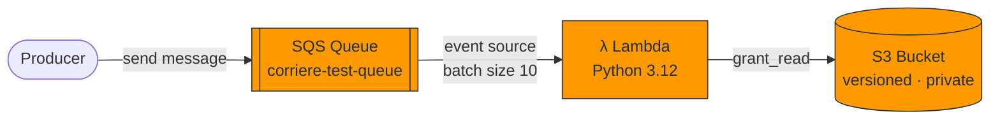

<div align="center">

# ☁️ aws-cdk-starter

### A production-shaped AWS CDK starter in Python

**S3 → SQS → Lambda**, wired the right way — hardened defaults, pinned dependencies, full unit-test coverage, and CI out of the box.

[](https://github.com/Corrierethan/aws-cdk-starter/actions/workflows/ci.yml)


</div>

---

## ✨ Why this starter?

Most CDK examples stop at "hello world." This one is shaped like something you'd actually ship:

- 🔒 **Secure by default** — private, versioned S3; least-privilege IAM grants; no wildcard policies.
- 🔗 **Real event wiring** — SQS is a genuine Lambda event source, not just three disconnected resources.
- 📌 **Deterministic builds** — every dependency is pinned for reproducible installs.
- ✅ **Tested** — CDK assertion tests verify the synthesized CloudFormation, not just that the code imports.
- 🤖 **CI included** — GitHub Actions runs `pytest` + `cdk synth` on every push and PR.

---

## 🏗️ Architecture



| Resource | Configuration | Hardening |
|----------|---------------|-----------|
| **S3 Bucket** | Versioning enabled | All public access blocked |
| **SQS Queue** | 300 s visibility timeout | Decouples producer from compute |
| **Lambda** | Python 3.12 runtime | Read-only access to S3, SQS-triggered |

---

## 📋 Prerequisites

| Tool | Version | Notes |
|------|---------|-------|
| Python | 3.12+ | Runtime + tests |
| Node.js | 18+ | Required by the CDK CLI |
| AWS CDK | v2 | `npm install -g aws-cdk` |
| AWS credentials | — | `aws configure` or environment variables |

---

## 🚀 Quick start

```bash
cd cdk_src

# Create and activate a virtual environment
python -m venv .venv
.venv\Scripts\activate          # Windows
# source .venv/bin/activate     # Linux / macOS

# Install dependencies
pip install -r requirements.txt
pip install -r requirements-dev.txt

# Bootstrap your account/region (first time only)
cdk bootstrap

# Preview the CloudFormation template
cdk synth

# Deploy
cdk deploy
```

> 💡 **First time using CDK in this account/region?** Run `cdk bootstrap` once to provision the toolkit stack CDK uses for deployments.

---

## 🧪 Running tests

```bash
cd cdk_src
pytest tests/ -v
```

The suite uses the CDK [`assertions`](https://docs.aws.amazon.com/cdk/v2/guide/testing.html) module to validate the **synthesized template**:

| Test | Verifies |
|------|----------|
| `test_sqs_queue_created` | Queue exists with a 300 s visibility timeout |
| `test_s3_bucket_versioning_enabled` | Bucket versioning is `Enabled` |
| `test_s3_bucket_blocks_public_access` | All four public-access blocks are on |
| `test_lambda_runtime_is_python312` | Lambda runs on `python3.12` |
| `test_lambda_sqs_event_source_mapping` | Exactly one SQS→Lambda mapping exists |

---

## 🛠️ Useful CDK commands

| Command | Description |
|---------|-------------|
| `cdk ls` | List all stacks in the app |
| `cdk synth` | Emit the synthesized CloudFormation template |
| `cdk diff` | Compare deployed stack with current state |
| `cdk deploy` | Deploy the stack to your default AWS account/region |
| `cdk destroy` | Tear down the deployed stack |
| `cdk doctor` | Diagnose common environment issues |

---

## 📁 Project layout

```
aws-cdk-starter/
├── .github/
│   └── workflows/
│       └── ci.yml                # pytest + cdk synth on push & PR
├── cdk_src/
│   ├── app.py                    # CDK app entry point
│   ├── cdk.json                  # CDK toolkit config
│   ├── requirements.txt          # Runtime dependencies (pinned)
│   ├── requirements-dev.txt      # Test dependencies (pinned)
│   ├── cdk_src/
│   │   └── cdk_src_stack.py      # Stack definition (S3 + SQS + Lambda)
│   ├── lambda/lambda/
│   │   └── hello_lambda.py       # Lambda handler
│   └── tests/unit/
│       └── test_cdk_src_stack.py # CDK assertion unit tests
└── README.md
```

---

## 🔐 Security notes

- **No hardcoded secrets** — credentials come from the standard AWS provider chain.
- **Least privilege** — the Lambda receives only `grant_read` on the bucket, no broad IAM actions.
- **Private storage** — the S3 bucket blocks all public access and enables versioning for recoverability.
- **Pinned dependencies** — reduces supply-chain drift and makes `pip install` reproducible.

---

## 🗺️ Roadmap

- [ ] Dead-letter queue (DLQ) for failed SQS messages
- [ ] CloudWatch alarms + log retention policy on the Lambda
- [ ] `cdk diff` gate in CI
- [ ] Second stack (VPC / API Gateway) to demonstrate multi-stack apps
- [ ] Integration test against `cdk synth` output snapshots

---

## 🤝 Contributing

1. Fork & branch: `git checkout -b feat/my-change`
2. Make your change and add/adjust tests
3. Run the suite: `pytest tests/ -v`
4. Open a PR — CI will run `pytest` and `cdk synth` automatically

---

<div align="center">

**Built by Ascent DevOps**
Veteran-Owned · SDVOSB

</div>
